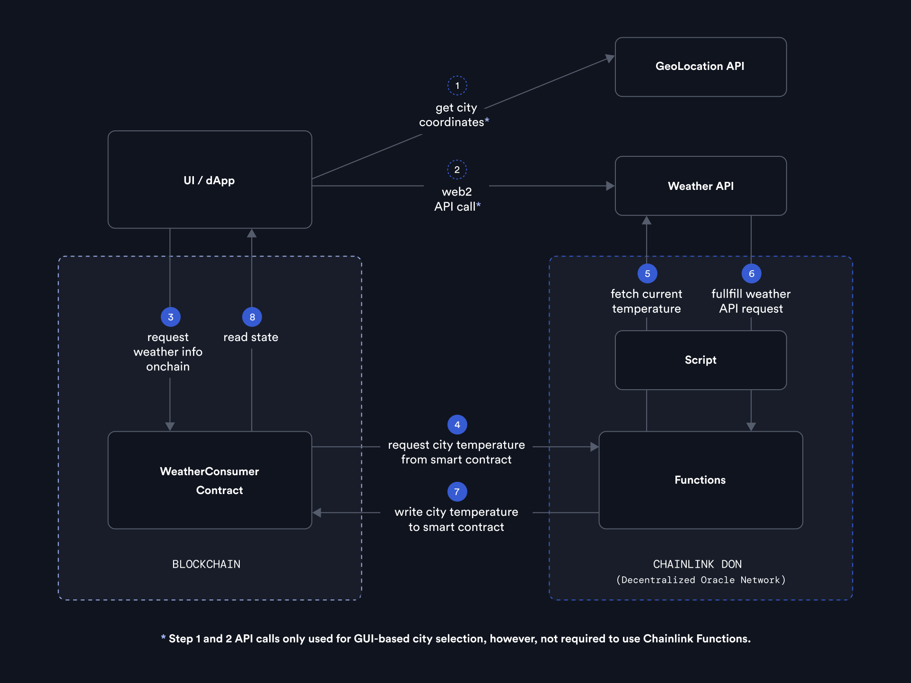

> **Note**
>
> _This demo represents an educational example to use a Chainlink system, product, or service and is provided to demonstrate how to interact with Chainlink’s systems, products, and services to integrate them into your own. This template is provided “AS IS” and “AS AVAILABLE” without warranties of any kind, it has not been audited, and it may be missing key checks or error handling to make the usage of the system, product or service more clear. Do not use the code in this example in a production environment without completing your own audits and application of best practices. Neither Chainlink Labs, the Chainlink Foundation, nor Chainlink node operators are responsible for unintended outputs that are generated due to errors in code._

# Chainlink Functions Playground

This project is an example dApp, designed to run on the Fuji testnet (Avalanche), that uses [Chainlink Functions](https://docs.chain.link/chainlink-functions/). It demonstrates how to use Chainlink Functions in a full-stack implementation with a real smart contract code, coupled with an easy to follow guideance on how it works under the hood. The functionality allows users to query a city's temperature from a web2 API and then write it on-chain via a smart contract.

Chainlink Functions is used to determine the input city's current temperature. 

**NOTE**: This example is not production ready, as edge cases are not handled.

## Usage

The dApp is designed so the end user does not have to connect a wallet nor create a Chainlink Functions subscription. This is all handled by the dApp.

## Architecture

This dApp consists of two parts: the contracts and the web UI.

### Overview



## Frontend

The `./app` directory is a Next.js project bootstrapped with [`create-next-app`](https://nextjs.org/docs/pages/api-reference/create-next-app).

It contains the frontend for the Chainlink Functions playground demo dApp.

### Quick Start

Install all dependencies:

```bash
cd app
npm install
```

Set environment variables by copying `.env.example` to `.env` and filling in the values:

- `NEXT_PUBLIC_ALCHEMY_API_KEY` for the network you want to use. You can get one from [Alchemy](https://www.alchemy.com/).
- `NEXT_PUBLIC_WALLET_CONNECT_ID` for the wallet connector. You can get one from [WalletConnect](https://walletconnect.org/).
- `NEXT_PUBLIC_GTM_ID` Google Analytics id.
- `GEOCODING_API_KEY` - API KEY from Open-Meteo.com for fetching weather data.
- `CONTRACT_ADDRESS` of the deployed contract.
- `NETWORK_RPC_URL` - Avalanche testnet RPC endpoint.
- `PRIVATE_KEY` - for the signing and broadcasting transactions in the backend (Nextjs server components).

For enabling ratelimiting you need to also fill in the following `.env` variables:
- `KV_URL` - Vercel KV URL
- `KV_REST_API_URL` - Vercel KV REST API url
- `KV_REST_API_TOKEN` - Vercel KV REST API token
- `KV_REST_API_READ_ONLY_TOKEN` - Vercel KV REST API read only token
- `RATELIMIT_IP_EXCEPTION_LIST` - list of IPs which should be excluded from the ratelimit functionality, separated with comma (ex. `"127.0.0.1,8.8.8.8,1.1.1.1"`)

You can get those from your Chainlink platform coordinator.

Run `npm run dev` in your terminal, and then open [localhost:3000](http://localhost:3000) in your browser.

### Tech Stack

-   [Next.js](https://nextjs.org/)
-   [TypeScript](https://www.typescriptlang.org/)
-   [Tailwind CSS](https://tailwindcss.com/)
-   [RainbowKit](https://www.rainbowkit.com/)
-   [wagmi](https://wagmi.sh/) & [viem](https://viem.sh/)
-   [shadcn/ui](https://ui.shadcn.com/)

## Backend

`./contracts` folder is a Hardhat project with a full Chainlink Functions enabled smart contract implementation.

### Project Details

`WeatherConsumer.sol` contract implements a Chainlink Functions consumer which runs a weather request check for the provided geolocation on the set weather API.

### Tech Stack

-   [hardhat](https://hardhat.org/)

### Quick start

1. Install dependencies

```bash
cd contracts
npm install
```

2. Set environment variables by copying `.env.example` to `.env` and filling in the values:

- `PRIVATE_KEY` - for the account you want to use.
- `SNOWTRACE_API_KEY` - API key for Snowtrace node access.

### Deploy

You can deploy the contract by executing the deploy script:

```bash
npx hardhat run scripts/deploy.ts --network fuji
```

### Testing

1. In order to test this project you need to have filled the .env.example file

2. `npx hardhat test`

## Disclaimer
> :warning: **Disclaimer**: The code used in this Chainlink Functions quickstart template comes from Chainlink community members and has not been audited. The Chainlink team disclaims and shall have no liability with respect to any loss, malfunction, or any other result of deploying a Quickstart Template. By electing to deploy a Quickstart Template you hereby acknowledge and agree to the above.
